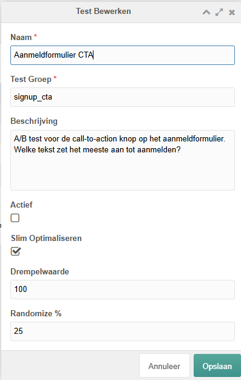
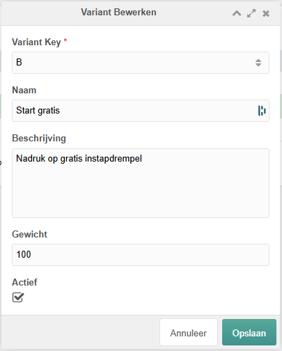
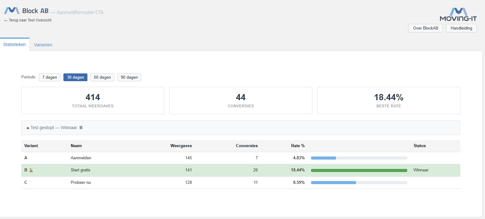
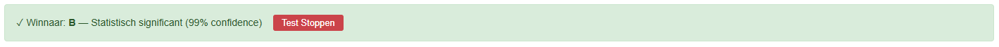

# BlockAB — Marketing Guide

**For:** Marketing staff who want to set up, monitor and close A/B tests.
**Assumption:** BlockAB is installed and all pages are ready for use.

---

## What is an A/B test?

You show visitors different versions of the same block (e.g. a different headline, button text or image). BlockAB tracks which version generates the most conversions and automatically calculates whether the difference is statistically reliable.

---

## 1. Navigating to BlockAB

In the MODX admin panel, go to **Components → BlockAB**.

You will see two tabs:
- **Tests** — all active and running tests
- **Archived** — closed tests

---

## 2. Creating a new test

Click **Create Test** (or right-click → Create in the grid).



Fill in:

| Field | What to enter |
|---|---|
| **Name** | A clear description, e.g. `Sign-up Form CTA` |
| **Test Group** | A unique code without spaces, e.g. `signup_cta`. **Pass this code to the developer** — they will link the MIGX blocks to it. |
| **Description** | Optional: your hypothesis or goal |
| **Active** | Leave **off** until the developer has linked the blocks |
| **Smart Optimize** | Leave **on** — BlockAB will automatically send more traffic to the best-performing variant |
| **Threshold** | Number of conversions before smart optimisation starts (default: 100). Do not change unless you have a reason to. |
| **Randomize %** | Percentage of visitors who still receive a random variant after the threshold (default: 25). Do not change. |

Click **Save**.

---

## 3. Adding variants

After saving, a **Variants** overview appears at the bottom of the screen.

Click **Create Variant** and fill in per variant:



| Field | What to enter |
|---|---|
| **Variant Key** | The letter you pass to the developer: `A`, `B`, `C`, … The first available letter is suggested automatically. |
| **Name** | A descriptive name for the variant, e.g. `Sign up`, `Start for free` or `Try now` |
| **Description** | Optional: briefly note what you are testing in this variant, e.g. `Emphasis on free entry point` |
| **Weight** | How often this variant is shown relative to others. Leave at `100` for equal distribution. |
| **Active** | Leave **on** to include this variant in the test |

Create at least **2 variants**. More is possible, but with low website traffic it takes longer to get reliable results.

> **After this step, pass the Test Group key and Variant Keys to the developer.**
> The developer links the correct MIGX blocks to each variant.

---

## 4. Activating the test

Once the developer has linked the blocks:

1. Right-click the test in the grid → **Edit**
2. Set **Active** to on
3. Save

The test is now running. Visitors will automatically be shown a random variant.

---

## 5. Viewing statistics

Click on a test to open the statistics and go to the **Statistics** tab.



### Period

At the top you can choose the period for which you want to see the statistics: **7 days**, **30 days**, **60 days** or **90 days**. The active period is highlighted in blue.

### The three summary numbers

| Number | Meaning |
|---|---|
| **Total Views** | How many times a variant has been shown to unique visitors |
| **Conversions** | How many of those visitors then completed a conversion |
| **Best Rate** | The highest conversion rate across all variants |

### The status banner

Directly below the cards you see a banner showing how the test is progressing:

| Banner | Meaning |
|---|---|
| 🟢 **Green** — *✓ Winner: X — Statistically significant (95% / 99% confidence)* | There is a reliable winner. The **Stop Test** button appears here. |
| 🟡 **Yellow** — *Test running — not yet conclusive* | The test is active but does not yet have enough data. Wait. |
| ⬜ **Grey** — *Test stopped — Winner: X* | The test has been stopped. The winner is shown. |
| ⬜ **Grey** — *No data* | The test has not yet started or has no views yet. |

The **green banner** also shows the reliability level: **95% confidence** or **99% confidence**. The higher, the more certain the result.

### The variants table

Per variant you see:

| Column | Meaning |
|---|---|
| **Variant** | The letter (A, B, C) and a 🏆 for the winner |
| **Name** | The name you entered when creating the variant |
| **Views** | Number of unique impressions |
| **Conversions** | Number of conversions |
| **Rate %** | Conversion rate — the higher the better |
| **Progress bar** | Visual comparison against the best-performing variant |
| **Status** | *Winner* for the winning variant |

The **winning row has a green background** and a green progress bar. Variants with fewer than 30 views get a warning icon — that data is not yet reliable.

### Date filter

Use the **7 / 30 / 60 / 90 days** buttons to see how the test performed in a specific period.

---

## 6. Stopping the test

When the green banner appears and you are convinced of the winner:



1. Click **Stop Test** in the green banner
2. Confirm the action

The test is set to inactive. All variants remain visible on the website until the developer sets the winner as the default.

> **Let the developer know which variant won**, so they can clean up the MIGX blocks.

---

## 7. Archiving a test

Closed tests can be archived to keep the Tests overview tidy:

1. Right-click the test → **Archive**
2. Confirm

Archived tests can be found in the **Archived** tab and can also be restored from there if needed.

> ⚠ **Note:** If you choose **Delete** (permanent), all statistics are gone forever. Use **Archive** instead.

---

## 8. When is a result reliable?

BlockAB does this automatically via a statistical test (chi-square). But here are practical guidelines:

| Situation | What to do |
|---|---|
| Green banner, 95% confidence | You may draw conclusions. Stop the test when you are ready. |
| Green banner, 99% confidence | Excellent reliability. Winner is clear. |
| Yellow banner, fewer than 100 views | Wait. Too little data for conclusions. |
| Yellow banner, more than 100 views | Test is running well. Wait for more conversions. |
| Active for weeks, no winner | Consider more radical variants or test a different element. |

**Rule of thumb:** Let a test run for at least **2 weeks**, even if a winner appears quickly.

---

## 9. Tips for good tests

**Test one thing at a time**
Only change the headline, or the button text, or the image. Not multiple things at once — then you won't know what made the difference.

**Formulate a hypothesis first**
_"I expect that mentioning a price in the headline will generate more quote requests, because visitors immediately know what to expect."_

**Choose high-impact elements**
Hero blocks, call-to-action buttons and headlines have the most impact on conversion.

**Be patient**
A test with little traffic needs weeks. Don't force conclusions based on too little data — the banner tells you when the time is right.

**Document the outcomes**
Note what you tested and what you learned. That helps with future tests.

---

## Quick overview: the workflow

```
1. Create test in BlockAB (name + test group key)
          ↓
2. Create variants (A, B, C with names and keys)
          ↓
3. Pass test group key + variant keys to developer
          ↓
4. Developer links MIGX blocks → you set test to Active
          ↓
5. Monitor test via statistics (daily or weekly)
          ↓
6. Green banner → determine winner → stop test
          ↓
7. Inform developer of winner → archive test
```

---

*Questions about the technical side? Contact your developer.*
